# MFC DLLs — Interview Tutorial

## 1. Big Picture

MFC DLLs can be broadly divided into:

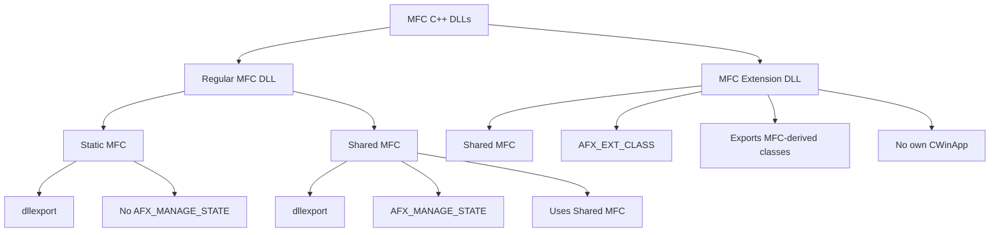

Microsoft documents regular MFC DLLs as DLLs that can use either static or shared MFC, while MFC Extension DLLs use shared MFC and are intended for MFC clients. [Microsoft Learn — MFC Library Versions](https://learn.microsoft.com/en-us/cpp/mfc/mfc-library-versions?view=msvc-170)

---

# 2. Regular MFC DLL

A **Regular MFC DLL** uses MFC internally but exposes an API to its caller.

The caller can be:

```text
MFC EXE
   |
   +----> Regular MFC DLL
```

or:

```text
Non-MFC EXE
   |
   +----> Regular MFC DLL
```

This is an important interview point.

### Calculator example

```text
CalculatorApp.exe
       |
       | Add(10,20)
       v
Calculator.dll
       |
       v
return 30
```

A regular MFC DLL commonly exposes functions instead of sharing MFC-derived objects.

Example:

```cpp
extern "C" __declspec(dllexport)
double Add(double a, double b);
```

---

# 3. Regular MFC DLL Architecture

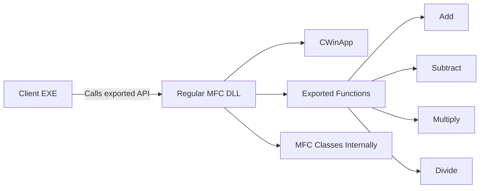

A regular MFC DLL has a `CWinApp`-derived application class, but it does not own the application's main message pump.

---

# 4. Regular MFC DLL — Static MFC

With static MFC, the MFC code used by the DLL is linked into the DLL.

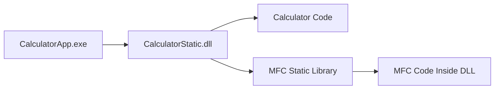

### Advantages

- No shared MFC DLL dependency for the DLL.
- More self-contained deployment.
- Can be called by MFC or non-MFC applications.
- Independent of the application's MFC version.

### Disadvantages

- Larger DLL.
- MFC code can be duplicated across multiple DLLs.
- Potentially more memory usage.

### Key points

```text
Regular Static MFC DLL
    |
    +-- CWinApp
    +-- __declspec(dllexport)
    +-- No AFX_MANAGE_STATE
    +-- MFC linked into DLL
```

---

# 5. Regular MFC DLL — Shared MFC

With shared MFC:

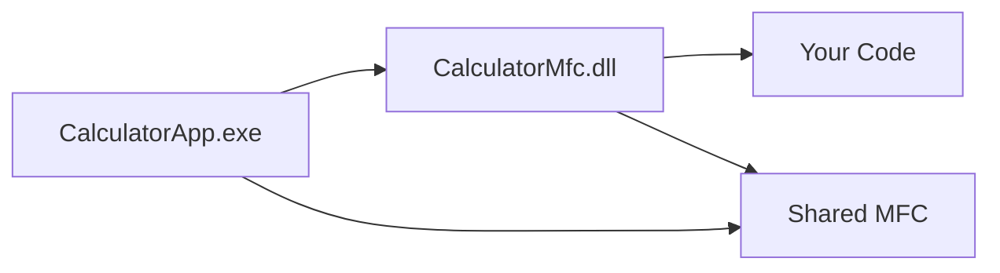

The application and DLL use the shared MFC runtime.

### Exported function

```cpp
extern "C" __declspec(dllexport)
double Add(double a, double b)
{
    AFX_MANAGE_STATE(AfxGetStaticModuleState());

    return a + b;
}
```

### Key points

```text
Regular Shared MFC DLL
    |
    +-- CWinApp
    +-- __declspec(dllexport)
    +-- AFX_MANAGE_STATE
    +-- Uses Shared MFC
```

`AFX_MANAGE_STATE` switches MFC to the DLL's module state while the exported function executes.

---

# 6. Why AFX_MANAGE_STATE?

This is a common interview question.

An EXE and a regular shared-MFC DLL can have different MFC module states.

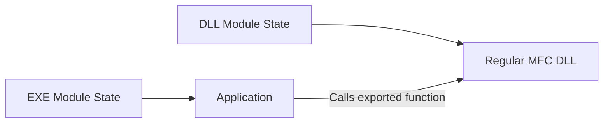

At the beginning of an exported function:

```cpp
AFX_MANAGE_STATE(AfxGetStaticModuleState());
```

MFC switches to the DLL's module state.

### Remember

```text
Regular Shared MFC DLL
        |
        +-- AFX_MANAGE_STATE = YES

Regular Static MFC DLL
        |
        +-- AFX_MANAGE_STATE = NO

MFC Extension DLL
        |
        +-- AFX_MANAGE_STATE = NO
```

---

# 7. MFC Extension DLL

An **MFC Extension DLL** is designed to extend MFC with reusable MFC-derived classes.

Example:

```cpp
class AFX_EXT_CLASS CCalculator : public CObject
{
public:
    double Add(double a, double b);
};
```

Unlike a regular DLL, the Extension DLL is intended to share MFC-derived classes and objects with an MFC client.

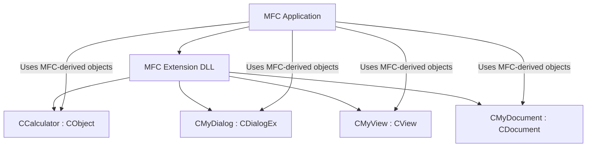

An Extension DLL requires an MFC client built with shared MFC.

---

# 8. Regular DLL vs Extension DLL

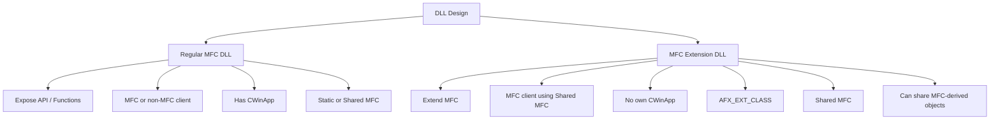

---

# 9. Calculator — Regular DLL Example

Our Regular DLL calculator exposes functions:

```cpp
extern "C" __declspec(dllexport)
double Add(double a, double b)
{
    AFX_MANAGE_STATE(AfxGetStaticModuleState());
    return a + b;
}
```

The application calls:

```cpp
double result = Add(10, 20);
```

Flow:

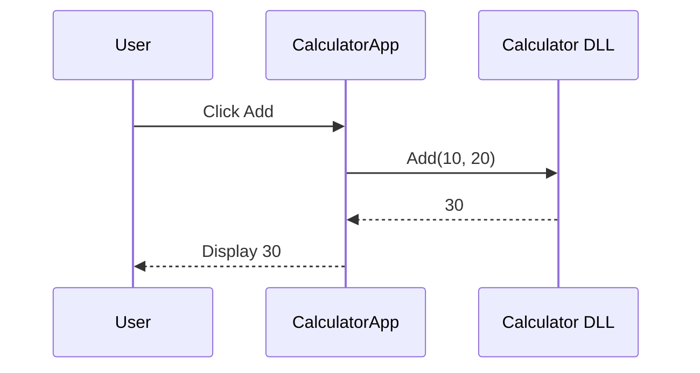

---

# 10. Calculator — Extension DLL Example

An Extension DLL can export a calculator class:

```cpp
class AFX_EXT_CLASS CCalculator : public CObject
{
public:
    double Add(double a, double b)
    {
        return a + b;
    }

    double Multiply(double a, double b)
    {
        return a * b;
    }
};
```

The MFC application can use the class:

```cpp
CCalculator calc;

double result = calc.Add(10, 20);
```

Architecture:

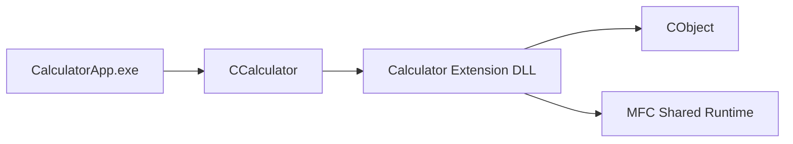

---

# 11. MFC Calculator Dialog Example

The dialog application contains:

```cpp
CCalculator m_calc;

double m_lVal1;
double m_lVal2;
double m_lResult;
```

The controls are connected using MFC DDX:

```text
IDC_EDIT_VAL1    -> m_lVal1
IDC_EDIT_VAL2    -> m_lVal2
IDC_EDIT_RESULT  -> m_lResult
```

A button handler can remain very simple:

```cpp
void CCalcAppDlg::OnBnClickedBtnSubstract()
{
    if (!UpdateData(TRUE))
        return;

    m_lResult = m_calc.Substract(m_lVal1, m_lVal2);

    UpdateData(FALSE);
}
```

Flow:

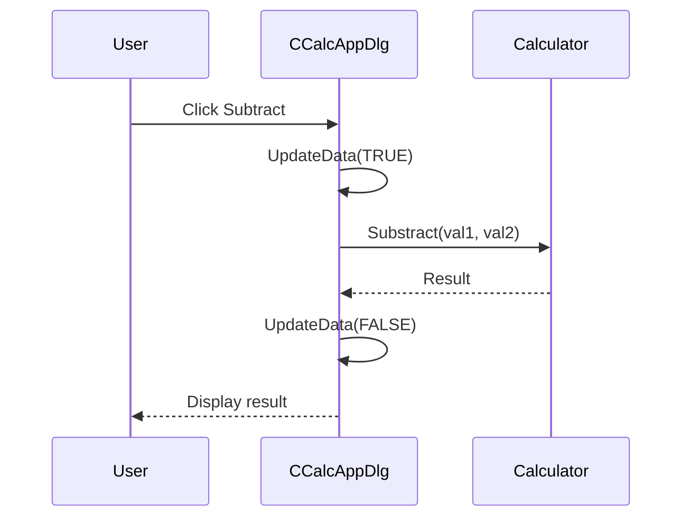

---

# 12. DLL Build and Runtime

The `.h`, `.lib`, and `.dll` have different purposes.

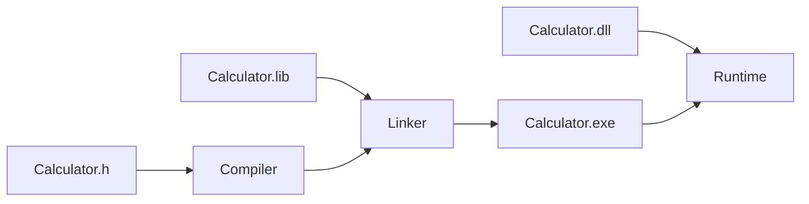

### Header `.h`

Contains declarations:

```cpp
double Add(double a, double b);
```

### Import library `.lib`

Used by the linker to resolve DLL symbols.

### DLL `.dll`

Contains the actual implementation loaded at runtime.

---

# 13. `__declspec(dllexport)` vs `AFX_EXT_CLASS`

Remember:

| DLL type | Export mechanism |
|---|---|
| Regular MFC DLL | `__declspec(dllexport)` |
| Regular non-MFC DLL | `__declspec(dllexport)` |
| MFC Extension DLL | `AFX_EXT_CLASS` |

Regular DLL:

```cpp
extern "C" __declspec(dllexport)
double Add(double a, double b);
```

Extension DLL:

```cpp
class AFX_EXT_CLASS CCalculator : public CObject
{
};
```

---

# 14. CWinApp — Important Interview Point

### Regular MFC DLL

Has a `CWinApp`-derived class:

```cpp
class CMyDllApp : public CWinApp
{
};
```


### Extension DLL

Does not create its own `CWinApp`.

It uses the MFC application's `CWinApp`.

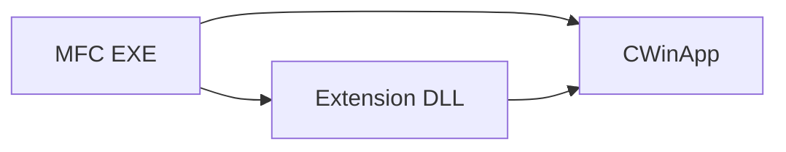

---

# 15. When Should I Use Which?

## Use Regular MFC DLL when:

You want to expose functionality/API.

Examples:

```text
Calculate()
ReadFile()
Compress()
ProcessData()
```

The caller does not need to know about the DLL's internal MFC classes.

## Use MFC Extension DLL when:

You want to extend MFC or share MFC-derived classes.

Examples:

```text
CMyDialog : CDialogEx
CMyView   : CView
CMyDoc    : CDocument
CMyWnd    : CWnd
```

---

# 16. Interview Cheat Sheet

```text
REGULAR MFC DLL
----------------
Purpose:
    Expose functionality/API

Client:
    MFC or non-MFC

CWinApp:
    YES

MFC:
    Static OR Shared

Export:
    __declspec(dllexport)

Shared MFC:
    AFX_MANAGE_STATE = YES


MFC EXTENSION DLL
-----------------
Purpose:
    Extend MFC / share MFC classes

Client:
    MFC application/DLL using Shared MFC

CWinApp:
    NO own CWinApp

MFC:
    Shared only

Export:
    AFX_EXT_CLASS

MFC-derived objects:
    Can be shared
```

---

# 17. One-Minute Interview Answer

**Question: What is the difference between a Regular MFC DLL and an MFC Extension DLL?**

A strong answer:

> A Regular MFC DLL uses MFC internally and exposes an API to the client. The client can be an MFC or non-MFC application. A Regular MFC DLL can statically or dynamically link to MFC. For a shared-MFC Regular DLL, exported functions use `AFX_MANAGE_STATE`.
>
> An MFC Extension DLL is specifically designed to extend MFC and export reusable MFC-derived classes. It requires an MFC client using shared MFC, uses `AFX_EXT_CLASS`, and does not create its own `CWinApp`. It can also pass MFC-derived objects between the application and DLL.

---

# 18. Final Architecture to Remember

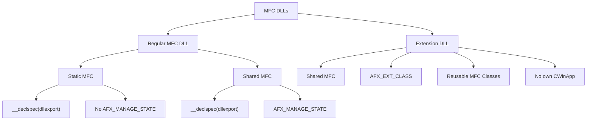

## Official Microsoft References

- MFC Library Versions — Microsoft Learn
- Regular MFC DLLs Dynamically Linked to MFC — Microsoft Learn
- MFC Extension DLLs: Overview — Microsoft Learn
- Classes and Functions Generated by the MFC DLL Wizard — Microsoft Learn
